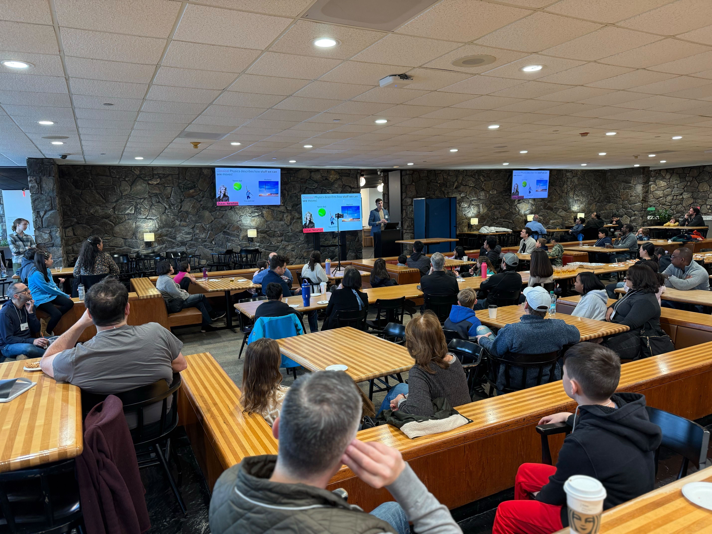

Congratulations and thank you for joining us!  We hope you had fun learning with the IBM Family Science team.  This program gave you the opportunity to meet with real scientists, engineers and mathematicians as they led the sessions. 
This page will also be posted on our website  https://ibm.biz/familyscience so you can click on the links.  Please see US – In Person Program, and select Graduation Note.

If you enjoyed these sessions, we hope you keep learning about science and technology: 
- When you go on family vacations, visit a science museum in that location
-	Sign up for STEM camps, if your school has them
-	Join your school’s robotics efforts.  To learn more about Robotics, consider FIRST LEGO LEAGUE (FLL).  It is a competition for kids 9 to 16 years old - to learn to work as a team while finding solutions to real life problems and programming a robot to complete missions
https://www.firstlegoleague.org/ 
-	See additional activities and websites below

We need more engineers and scientists.  We encourage parents to support their students’ interests in developing their abilities in science.  

**CERTIFICATES**  
We have provided a certificate to honor the students for taking these classes

**ABOUT IBM RESEARCH**  
IBM Research is one of the largest industrial research organizations in the world, with 12 labs in 6 continents.  IBM employees have won 6 Nobel Prizes, 6 Turing Awards, 20 inductees into the U.S. National Inventors Hall of Fame, 19 National Medals of Technology, 5 National Medals of Science and 3 Kavli Prizes.  IBM has been the leader in patents for over 26 years, many of them originating in Research.  Inventions you may be familiar with are ATMs, UPC bar codes and Lasik surgery.  Our scientists are charting the future of artificial intelligence and breakthroughs like quantum computing.

**ADDITIONAL ACTIVITIES AND WEBSITES (These are non-IBM sites)**
1.	The New York Hall of Science (NYSCI) https://nysci.org/
brings the best of their hands-on science learning resources to families via the internet. IBM is a sponsor of NYSCI. 
2.	Visit the [International Space Station site](https://www.issnationallab.org/stem/learn-at-home/) and the NASA STEM for [K-4](https://www.nasa.gov/stem-at-home-for-students-k-4.html) and [Grades 5-8](https://www.nasa.gov/learning-resources/for-students-grades-5-8/)
3.	If you are interested  Programming here are some fun [Tutorials](https://scratch.mit.edu/projects/editor/?tutorial=all) and [Explore Projects](https://scratch.mit.edu/explore/projects/all)
4.	Learn more about climate change and how to be a superhero:  
    -  [NASA Climate Kids](https://climatekids.nasa.gov/menu/make/) or https://climatekids.nasa.gov
    -  [National Geographic Kids](https://kids.nationalgeographic.com/science/article/climate-change)
    -  [American Museum of Natural History Kids](https://www.amnh.org/explore/ology/climate-change)

5. You learned about Quantum Computing during a pre-class in March, you can learn more with these 2 videos (there are some ads, and you can skip through them):
 
    - A video that explains Quantum to different age groups
        https://www.youtube.com/watch?v=OWJCfOvochA
 
    - A current video that explains Quantum with a visit to IBM Research
        https://www.youtube.com/watch?v=e3fz3dqhN44

6.	If you and your family speak Spanish, you may want to visit this website for Girls in STEM created in Spain, IBM Family Science contributed to this effort – [STEM en Femenino](https://www.stemenfemenino.org/)

### Have fun and stay safe!
**Grace Kaplan**, IBM Family Science Coordinator

