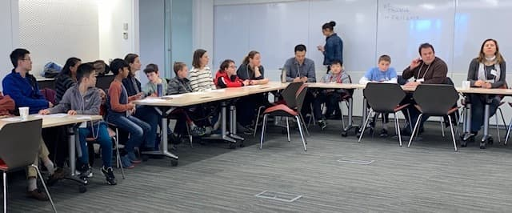
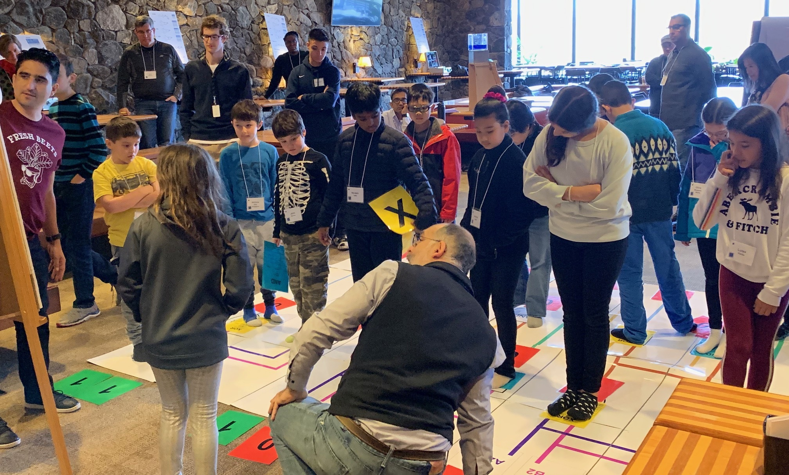
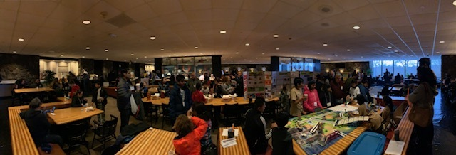
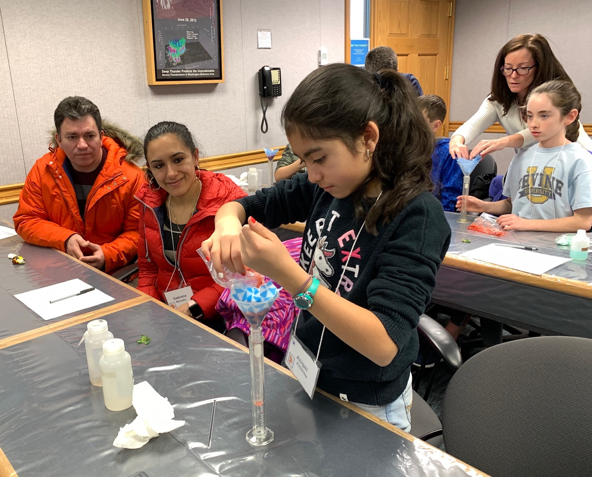
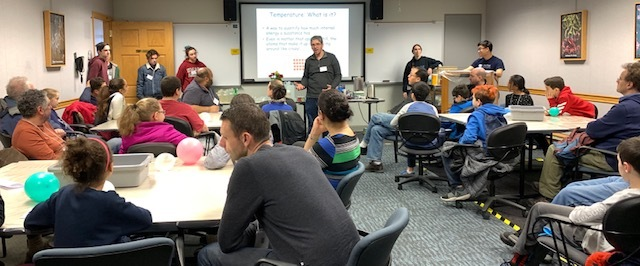
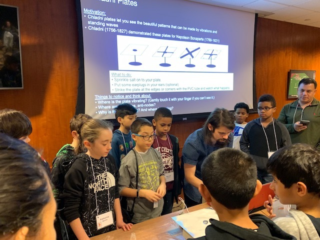

<AnchorLinks>
  <AnchorLink>Algorithms</AnchorLink>
  <AnchorLink>Electronics</AnchorLink>
  <AnchorLink>Kitchen Chemistry</AnchorLink>
  <AnchorLink>Polymers</AnchorLink>
  <AnchorLink>States of Matter</AnchorLink>
  <AnchorLink>Waves</AnchorLink>
</AnchorLinks>

## Algorithms

Want to build your own Watson? This introduction to your Must Know Algorithms will help you solve challenging and important problems using everyday concepts.

## Electronics

Have you ever wondered how computers do what they do? In this class you will learn how computers are made and how they work -- on the inside.

## Kitchen Chemistry

A virtual taste of Chemistry - have fun learning Chemistry right in your own kitchen.

## Polymers

Learn about polymers all around us - how to extract DNA from a strawberry!

## States of Matter

We are surrounded by gases, liquids and solids.  Learn about these states of matter, and view fun demonstrations showing the strength of air pressure.

## Waves

Waves, resonance, sound and light are part of your everyday life. Learn more and have fun with our experiments!

